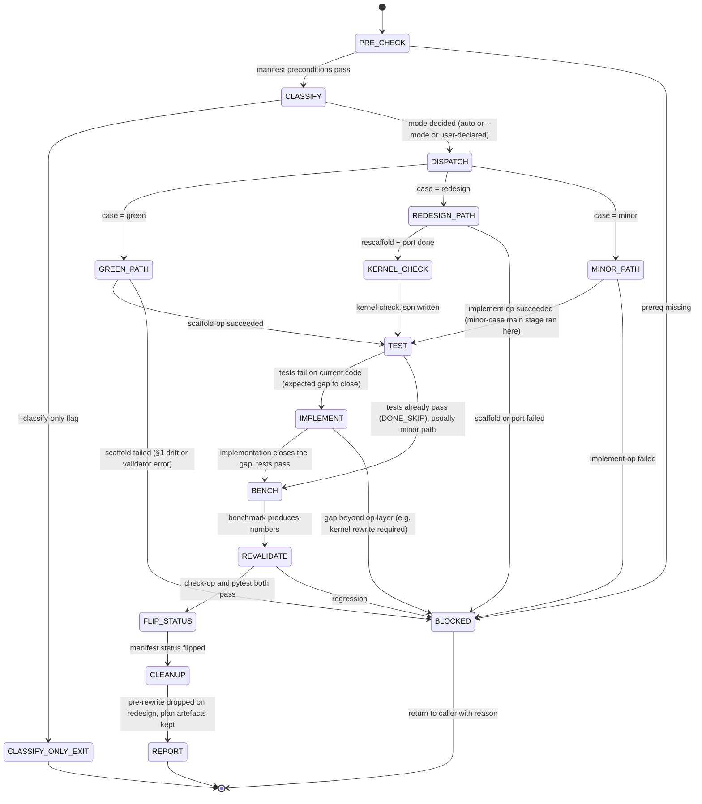

## Arguments

- `op_name` (positional) — manifest key, e.g. `CumsumFwdOp`.
- `--mode=green|redesign|minor` (optional) — override the automatic classification. When omitted, `CLASSIFY` decides (auto if unambiguous, otherwise prompt).
- `--classify-only` (optional) — stop after `CLASSIFY`; write `mode.json` and return without executing any case path. Use to ask "which case is this op in?" without side effects.

## Contract

- **Input**: `op_name` must be present in [`src/tileops/manifest/`](../../../src/tileops/manifest/) with `status: spec-only` (same preconditions as scaffold-op; see [PRE_CHECK](#pre_check)).
- **Path and data bindings used throughout this skill** (resolved by the orchestrator once at `PRE_CHECK` when the manifest entry is first loaded, then passed into every sub-skill invocation):
  - `<source_op>` — `src/` + manifest `source.op` (e.g., `src/tileops/ops/reduction/cumulative.py`).
  - `<source_test>` — manifest `source.test` path (e.g., `tests/ops/test_cumulative.py`).
  - `<source_bench>` — manifest `source.bench` path.
  - `<source_kernel>` — `src/` + manifest `source.kernel` (the primary kernel implementation file).
  - `<manifest_signature>` — the `signature` sub-tree from the op's manifest entry, passed verbatim to test-op / implement-op.
  - `<pytorch_equivalent>` — manifest `ref_api` value (e.g., `"torch.cumsum"`) or `null` if the op has no PyTorch reference. Required by test-op.
- **Output** (SUCCESS path): op file at `source.op` aligned with the manifest; test file `source.test` aligned; `__init__.py` registrations consistent; `status` flipped `spec-only → implemented` (single commit). Side-artefacts in `.foundry/plan/<op_name>/`: `mode.json` (classification), `plan.json` (scaffold-op's §1/§2/§3 when that skill ran), `kernel-check.json` (redesign case only), `pre-rewrite/source.py` (redesign case, removed at CLEANUP on SUCCESS).
- **Termination (success)**: `python scripts/validate_manifest.py --check-op <op_name>` reports no errors + `python -m pytest <source_test> -v` passes + benchmark produces numbers + manifest status flipped.
- **Termination (blocked)**: any sub-skill (scaffold-op / test-op / implement-op / bench-op) returns blocked; or scaffold-op §1 drift; or REVALIDATE fails. Kernel-layer mismatches surfaced by `KERNEL_CHECK` are **informational only** and never cause BLOCKED by themselves — BLOCKED is reached only if a kernel drift propagates into a downstream sub-skill failure (e.g., bench-op runtime error, REVALIDATE regression). Archives are kept for post-mortem.
- **Constraints**:
  - Only align-op (and only at FLIP_STATUS) may modify `src/tileops/manifest/`. Sub-skills never touch the manifest.
  - MUST NOT modify kernel code. Kernel-layer work, if needed, is surfaced via `kernel-check.json` as a separate follow-up.
  - MUST NOT expand to multi-op scope; that is `align-family`'s role.

## Trust model

- `CLASSIFY`, `DISPATCH`, `FLIP_STATUS`, `CLEANUP`, `REPORT` are orchestrator stages (align-op itself). Every other stage delegates to an atomic skill as a **separate sub-agent invocation**:

  | Stage         | Sub-skill                                                    |
  | ------------- | ------------------------------------------------------------ |
  | GREEN path    | `scaffold-op`                                                |
  | REDESIGN path | `scaffold-op` (after ARCHIVE + CLEAR)                        |
  | MINOR path    | `implement-op`                                               |
  | TEST          | `test-op`                                                    |
  | IMPLEMENT     | `implement-op` (green / redesign only; minor already did it) |
  | BENCH         | `bench-op`                                                   |

  Separate invocations preserve the per-skill contracts (e.g., scaffold-op's §1 fact-freeze; implement-op's no-test-modification rule).

- After each sub-skill returns, align-op verifies `git status --porcelain` is empty before dispatching the next. If a sub-skill left an uncommitted change, align-op commits on its behalf with `Sub-skill [name]: [summary]` before proceeding.

## Workflow



## Steps

### <a id="pre_check"></a>1. PRE_CHECK

Preconditions identical to `scaffold-op`'s — orchestrator enforces them up front so sub-skills never see ill-formed input:

- `op_name` in `src/tileops/manifest/` → proceed; otherwise BLOCKED ("op not in manifest").
- `status: spec-only` → proceed; `implemented` → BLOCKED ("already aligned; flip status back to spec-only first if you intend to re-align"); missing/other → BLOCKED.
- `source.kernel` names a backend module that exists, or is `null` → proceed. Aligning the op layer does not need a kernel: the seam it aligns to is the manifest signature a backend's `build_kernel` is called with.

### 2. CLASSIFY

Decide which case applies. Machine-decidable input: does `source.op` exist?

| Input                      | Auto case | User prompt?                                                |
| -------------------------- | --------- | ----------------------------------------------------------- |
| `source.op` does not exist | `green`   | no                                                          |
| `source.op` exists         | (unknown) | yes — "redesign (rewrite + port) or minor (in-place edit)?" |

`--mode=<case>` overrides prompting only when consistent with file presence. The orchestrator validates this during CLASSIFY and BLOCKs immediately on invalid combinations so sub-skills never see contradictory input:

- `source.op` **missing** → only `green` is valid. `--mode=minor` → BLOCKED ("`source.op` is missing; cannot edit a non-existent op file; use `--mode=green` or omit `--mode`"). `--mode=redesign` → BLOCKED ("`source.op` is missing; no archive source to rewrite; use `--mode=green` or omit `--mode`").
- `source.op` **exists** → `--mode=green` → BLOCKED ("`source.op` already exists; green-field scaffold would silently overwrite; use `--mode=redesign` for rewrite+port or `--mode=minor` for in-place edit").

**First-op bias.** If no op in the same `family` has `status: implemented` and follows the canonical pattern (`docs/design/ops-design.md` § Step 3), set `auto-case = redesign` (skip the prompt). mode.json: `decided_by: "auto"`, `reason: "no canonical-pattern precedent in family <name>"`. User may override with `--mode=minor`.

Write `.foundry/plan/<op_name>/mode.json`:

```json
{
  "op_name": "CumsumFwdOp",
  "case": "redesign",
  "file_present": true,
  "kernel_class_importable": true,
  "decided_by": "user_prompt",
  "reason": "User declared: manifest _static_axes shape rewritten; structural redesign.",
  "classified_at": "YYYY-MM-DDTHH:MM:SSZ"
}
```

`decided_by` is one of `auto` / `user_prompt` / `flag_override`. `reason` is free-form text.

If `--classify-only` was passed, terminate here and print the mode.json content. No other side effects.

### 3. DISPATCH — case-specific main stage

Each path produces the aligned op file under `source.op` plus whatever artefacts the sub-skill creates under `.foundry/plan/<op_name>/`.

#### 3a. GREEN path (`case = green`)

```
scaffold-op <op_name>
```

Sub-skill does PRE_CHECK → DRY_RUN (plan.json) → EMIT → REGISTER → VALIDATE → REPORT. align-op waits for SUCCESS or BLOCKED; on BLOCKED, surface the row and terminate.

#### 3b. REDESIGN path (`case = redesign`)

Sequence:

1. **ARCHIVE** — `mkdir -p .foundry/plan/<op_name>/pre-rewrite/`, copy `source.op` there as `source.py` (rename: strip family path, keep basename). The archive is the source of truth for manual porting. It persists until CLEANUP.
1. **CLEAR** — remove `source.op` from the tree; remove the op's `from .<module> import <ClassName>` line and its `__all__` entry from the package `__init__.py`. Commit as `[Chore] align-op: archive <op_name> before rescaffold`.
1. **SCAFFOLD** — `scaffold-op <op_name>`. Target now absent, PRE_CHECK passes, emits the 17 mechanical slots.
1. **PORT** — read `pre-rewrite/source.py` and port op-specific content that the scaffold cannot produce:
   - Optional hooks (`_pad_value`, `_validate_dim`, `_pre_kernel`, `_post_kernel`, `_cache_key` override).
   - Family-specific protocol variables (`_op_kind`, `_kernel_key`, etc.) if the op was a T1 thin wrapper.
   - Any `forward` body specifics beyond the universal pattern (kernel-specific reshape/movedim choreography).
   - Any class-level non-slot attributes the old file had that still make sense under the new spec.
     Commit as `[Feat] align-op: port business logic for <op_name> from pre-rewrite`. If the agent is uncertain whether a specific override should be ported, record an `open_questions` item in plan.json §3 (`needs_human_decision`) and port conservatively.
1. **KERNEL_CHECK** — see §5 below.

#### 3c. MINOR path (`case = minor`)

```
implement-op(
  op_name=<op_name>,
  manifest_signature=<manifest_signature>,
  source_op=<source_op>,
  source_test=<source_test>
)
```

Sub-skill does ANALYZE → DIAGNOSE → IMPLEMENT → VALIDATE → MARK_DONE → COMMIT. align-op waits for SUCCESS or BLOCKED.

### 4. Skipped anchor (reserved)

### <a id="kernel_check"></a>5. KERNEL_CHECK (redesign path only)

Determine whether the kernel layer also needs work. align-op does **not** modify kernel code; it surfaces the question.

For the backend module named by `source.kernel`:

1. Inspect the kernel's `__init__` / `forward` / `_build_program` signatures (wherever applicable) in its source file.
1. Compare its registered `build_kernel` signature against the manifest signature the op layer will call it with. Specifically check:
   - Argument names and positional order.
   - Argument types.
   - Any layout / dtype expectations the kernel documents.
1. Classify per kernel:
   - `aligned` — new op's kernel invocation matches the kernel's ctor; no kernel work.
   - `signature_drift` — arg names or order differ; kernel ctor must be adjusted.
   - `semantic_drift` — the kernel expects a different data layout / dtype than the new op provides (e.g. op now passes `(M, N)` where kernel expects `(N, M)`).
   - `unknown` — cannot determine from static inspection.

Write `.foundry/plan/<op_name>/kernel-check.json`:

```json
{
  "op_name": "CumsumFwdOp",
  "checked_at": "YYYY-MM-DDTHH:MM:SSZ",
  "kernels": [
    {
      "dispatch_key": "cumulative_fwd",
      "kernel_class": "CumulativeKernel",
      "kernel_source": "src/tileops/kernels/families/scan.py",
      "classification": "aligned",
      "op_call": "self.get_or_build_kernel('cumulative_fwd', (x,))",
      "kernel_ctor": "__init__(self, M, N, op_kind, dtype, *, tune=False)",
      "notes": "Positional and named args match; no kernel work required."
    }
  ]
}
```

Non-`aligned` entries surface in REPORT as `needs_kernel_work` follow-ups. align-op itself continues to TEST — the downstream path may still pass if the kernel drift only affects performance (not correctness), or fail fast if the kernel mismatch causes runtime errors, which REVALIDATE will catch.

### 6. TEST

```
test-op(
  op_name=<op_name>,
  manifest_signature=<manifest_signature>,
  pytorch_equivalent=<pytorch_equivalent>,
  source_test=<source_test>
)
```

Sub-skill writes tests against the new spec. Termination:

- **tests fail on current code** (expected TDD seed) → proceed to IMPLEMENT.
- **DONE_SKIP** (tests already pass, e.g. a sibling migration fixed the base class, or minor-path `implement-op` already closed the gap in Step 3c) → skip IMPLEMENT, proceed to BENCH.

### 7. IMPLEMENT

```
implement-op(
  op_name=<op_name>,
  manifest_signature=<manifest_signature>,
  source_op=<source_op>,
  source_test=<source_test>
)
```

Closes the gap between the emitted op file and the tests from Step 6. Applies to:

- **Green path**: `scaffold-op` produced the 17 mechanical slots, but not optional hooks or family protocol vars; `implement-op` fills any that are required for the tests to pass.
- **Redesign path**: the `PORT` sub-step in Step 3b did a first pass; `implement-op` closes residual gaps surfaced by the tests.
- **Minor path**: **skipped** — `implement-op` already ran as the minor-case main stage in Step 3c. If TEST didn't DONE_SKIP here, that signals spec-drift beyond the minor-case scope and becomes BLOCKED.

BLOCKED if the gap requires kernel-layer changes (align-op is op-layer only; kernel work surfaces via `kernel-check.json` from KERNEL_CHECK or as a `blocked` return from `implement-op`).

### 8. BENCH

```
bench-op(
  op_name=<op_name>,
  source_bench=<source_bench>,
  source_op=<source_op>
)
```

Produces numbers. Sub-skill unchanged. If BLOCKED and reason is not kernel-related, propagate blocked.

### 9. REVALIDATE

```bash
python scripts/validate_manifest.py --check-op <op_name>
python -m pytest <source_test> -v
```

Both must pass. Regression after benchmark changes → BLOCKED.

### 10. FLIP_STATUS

Orchestrator (not a sub-skill) edits the manifest:

- `ops.<op_name>.status: spec-only` → `status: implemented`
- Commit as `[Refactor][Manifest] promote <op_name> to implemented`.

This is the only manifest write in the entire workflow: flip `status`, and retarget `source.kernel` / `source.test` / `source.bench` at what this run produced. A contractual field — `signature`, `shape_rules`, `roofline`, `params` — is spec, and changing it to match the code inverts the spec relationship ([manifest-spec.md](../../domain-rules/manifest-spec.md)).

### 11. CLEANUP

On SUCCESS path:

- Delete `.foundry/plan/<op_name>/pre-rewrite/` (redesign case only; archive purpose is served).
- Keep `mode.json`, `plan.json`, `kernel-check.json` as audit trail — they are under `.foundry/plan/` which is gitignored but persists in the local worktree.

On BLOCKED path: keep all artefacts for post-mortem.

### 12. REPORT

Single-page summary printed to stdout. Always includes:

```
Status: SUCCESS | BLOCKED
Op: <op_name>
Case: green | redesign | minor
Mode decided by: auto | user_prompt | flag_override
File: <source.op> (<lines>)

Sub-skills run:
  - scaffold-op: <SUCCESS|BLOCKED|skipped>
  - implement-op: <...>
  - test-op: <...>
  - bench-op: <...>

Plan artefacts (.foundry/plan/<op_name>/):
  - mode.json
  - plan.json (if scaffold-op ran)
  - kernel-check.json (if redesign path)
  - pre-rewrite/ (redesign path, cleaned on SUCCESS)

Status flipped: spec-only → implemented (commit <sha>)

Follow-ups:
  - <needs_kernel_work for kernel X> (from kernel-check.json non-aligned entries)
  - <needs_doc_fix for slot S21> (from plan.json §3)
  - <needs_human_decision about port of _pad_value> (from port observations)
```

On BLOCKED, replace "Status flipped" line with the blocking error and list remaining follow-ups.

## Interaction with `align-family`

`align-family` is the family-scoped orchestrator and delegates every per-op stage to `align-op`. Its workflow is `AUDIT → GROUP_BY_BASE → ROUTE → (per op: ALIGN_OP) → CLEANUP_GATE → CLEANUP → CREATE_PR`; the family orchestrator never invokes the atomic per-op skills (`scaffold-op` / `test-op` / `implement-op` / `bench-op`) directly — every per-op stage runs inside `align-op`'s contract.

- Use `align-op <op>` for per-op work (green field, redesign, or minor delta).
- Use `align-family <family>` for family-scoped historical migration of many ops at once.

They do not conflict. `align-op` never manages cross-op cleanup gates; that remains `align-family`'s. `align-op`'s `FLIP_STATUS` is the sole manifest-write site, observed by `align-family` via `align-op`'s SUCCESS return.

## Non-goals

- **Kernel scaffolding / kernel-layer edits.** align-op surfaces kernel work as a follow-up via `kernel-check.json`; a separate (future) `kernel-scaffold` / `kernel-align` skill will own that layer.
- **Family-level cleanup.** Cross-op dual-path removal lives in `align-family` and is not a concern of per-op alignment.
- **General auto-detection of "redesign vs minor."** The distinction is a design judgement; align-op prompts or accepts `--mode`. The one exception is the **first-op bias** in CLASSIFY (no canonical-pattern precedent in the family → auto `redesign`). Beyond that one case, no auto-detection.
