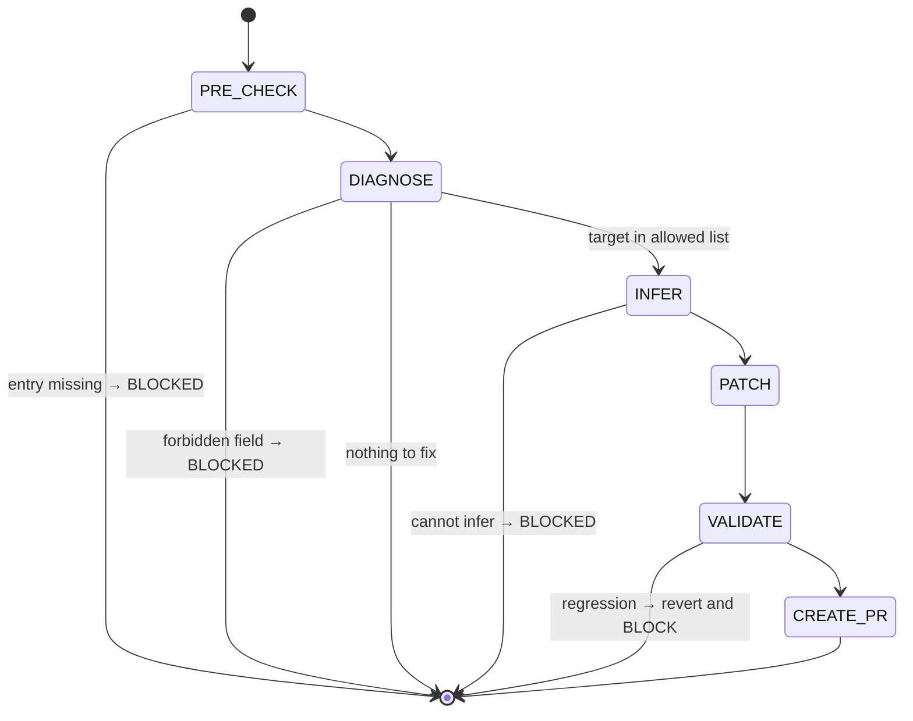

## Arguments

| Argument         | Required | Description                                                                                        |
| ---------------- | -------- | -------------------------------------------------------------------------------------------------- |
| `op_name`        | Yes      | One manifest key, or comma-separated list (e.g., `RMSNormFwdOp` or `SumFwdOp,MeanFwdOp,VarFwdOp`). |
| `--field=<name>` | No       | One of `static_dims`, `kernel`. Omit to auto-detect.                                              |
| `--dry-run`      | No       | Print diff and exit; no write, no PR.                                                              |

Multi-op: same `--field` applied to every op in the list. Multi-field is not supported — run again.

## Contract

- **MAY write** in `src/tileops/manifest/<family>.yaml` (the family file owning the entry): `signature.static_dims`, `source.kernel`. These two fields are derived from on-disk op / backend evidence, not from the reference API. Use `ruamel.yaml` for round-trip preservation.
- **MUST NOT write** anything else. Reference-derivable fields (`signature.{inputs,outputs,params,shape_rules,dtype_combos}`, `roofline.*`) belong to `add-manifest` — re-aligning those fields requires re-fetching the reference URL, which is `add-manifest`'s job. Other fields (`status`, `family`, `ref_api`, `workloads`, `source.{op,test,bench,bench_manifest_driven}`) are human-curated and not touched by either skill.
- **MUST NOT** create new entries — use `add-manifest`.
- **MUST NOT** flip `status` (that is `align-op@FLIP_STATUS`).
- **MUST NOT** edit op / kernel / test / bench code.
- **One field per invocation.**
- **Termination**: every patched op's validator output is **monotonic** (no new error category vs. before the patch), or BLOCKED.

## Workflow



## Steps

### 1. PRE_CHECK

Resolve `op_name` in `src/tileops/manifest/`. Missing → BLOCKED: `op not in manifest; use add-manifest`.

### 2. DIAGNOSE

When `--field=` is provided: must be `static_dims` or `kernel`; else BLOCKED. Skip both checks below.

When `--field=` is omitted, run two checks in strict order:

**Check A — `source.kernel` freshness.** If `source.kernel` is `null` but some backend now registers a builder for the op, or names a module that no longer exists → target = `kernel`, jump to INFER.

`kernel: null` is a legitimate state — it says no backend serves the op — so absence alone is not a defect. Do NOT extend this check to `static_dims` either: `docs/design/manifest.md` (R7, R20) explicitly allows `static_dims` to be absent on fixed-rank ops, and absence-only patching would manufacture changes for valid entries.

**Check B — validator output.** Run `python scripts/validate_manifest.py --check-op <op_name>`. Parse the first error:

- Field is `static_dims` → target = `static_dims`, jump to INFER.
- Field is reference-derivable (`signature.{inputs,outputs,params,shape_rules,dtype_combos}`, `roofline.*`) → BLOCKED with redirect: `"<field> belongs to add-manifest; re-align this entry with /add-manifest <op_name> <ref_url>"`.
- Other forbidden fields (`status`, `family`, etc.) → BLOCKED. Name the field, why it is out of scope, and what owns it.
- No errors and Check A also empty → no-op; print `nothing to fix` and exit 0.

Write `.foundry/plan/<op_name>/fix-diagnosis.json`: `{op_name, target_field, validator_excerpt, action}`.

### 3. INFER

Build the patch payload from on-disk evidence. **Never guess** — if inference is impossible, BLOCKED with `evidence_needed: <what>`.

**`kernel`** — grep `src/tileops/kernels/families/*.py` for `@register("<OpName>")`. One match → that module's repo-relative path. No match → `null`, with the reason on the line above. A second claim cannot happen (`_registry.register` refuses one); an out-of-tree backend claiming the same op → BLOCKED, since the manifest names one path.

**`static_dims`** — `signature.inputs` shape names that the op binds at construction time (each entry in the op's `__init__` kwarg block, excluding `dtype` / `target` / `tune` / `signature.params` entries — see `docs/design/ops-design.md` § "Step 3"). Cross-check with `roofline.vars` if present.

### 4. PATCH

First capture the validator baseline — **before any file mutation**:

```bash
python scripts/validate_manifest.py --check-op <op_name> > /tmp/fix-manifest-<op>-before.txt
```

Do NOT use `git stash` for this — unsafe on a dirty tree (pulls in unrelated user changes).

Then insert each new key as a **sibling** of existing keys in its parent block, at this exact position (verifiable from any sibling entry):

| Field         | YAML path               | Position                                                                                              |
| ------------- | ----------------------- | ----------------------------------------------------------------------------------------------------- |
| `kernel`      | `source.kernel`         | first key of the `source` block, before `source.op`                                                   |
| `static_dims` | `signature.static_dims` | between `signature.params` and `signature.shape_rules`; if `params` absent, after `signature.outputs` |

Preserve adjacent comments. Do not reorder unrelated keys. If the existing entry deviates from the canonical layout, fall back to the order in `docs/design/manifest.md`.

### 5. VALIDATE

Capture after-baseline and diff:

```bash
python scripts/validate_manifest.py --check-op <op_name> > /tmp/fix-manifest-<op>-after.txt
diff /tmp/fix-manifest-<op>-before.txt /tmp/fix-manifest-<op>-after.txt
```

Acceptable iff after's errors are a subset of before's (monotonic). Any new error → revert that op's patch and BLOCKED.

For multi-op runs: per-op independent. One op's regression reverts only that op's patch; siblings proceed.

Spec-only entries usually carry pre-existing errors (the reason they are spec-only — typically `[signature]` mismatches). Those are out of scope here — `align-op` closes them later.

### 6. CREATE_PR

If `--dry-run`, print diff and exit 0. Otherwise invoke `foundry:creating-pull-request`:

| Element | Single-op                                                                                                    | Multi-op                                                          |
| ------- | ------------------------------------------------------------------------------------------------------------ | ----------------------------------------------------------------- |
| title   | `[Maintain][Manifest] fix <field> for <op_name>` (use `[Fix][Manifest]` if validator was actively rejecting) | `[Maintain][Manifest] add <field> for <family> spec-only ops`     |
| branch  | `maintain/manifest/fix-<op-slug>-<field>`                                                                    | `maintain/manifest/fix-<family>-<field>`                          |
| body    | which field, evidence, validator before/after, scope guard                                                   | per-op evidence table; per-op monotonic-check result; scope guard |

## Guardrails

- One field per invocation.
- Never widen scope to a forbidden field — emit BLOCKED.
- Never invent values; payload must trace to a file or to `ref_api`.
- Never flip `status`.
- Validator output ambiguous → STOP, ask user.
