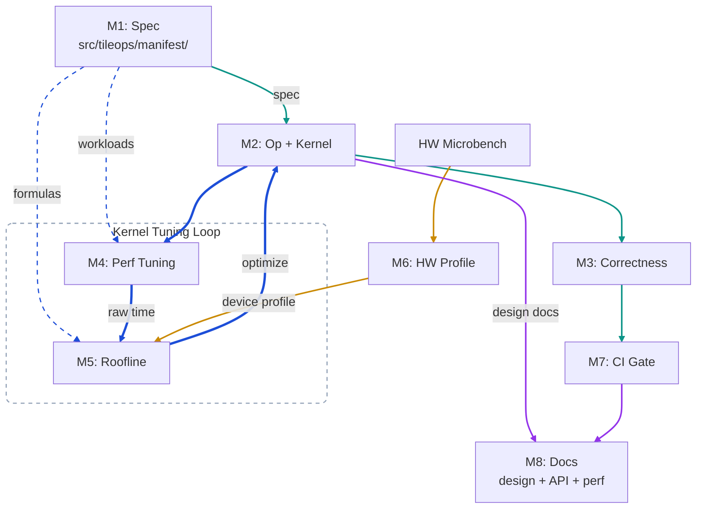

# Architecture

TileOPs is a spec-driven NPU operator platform built on TileLang. Every operator has a declarative specification in `src/tileops/manifest/` before code is written. The spec drives code generation, test validation, performance evaluation, and documentation — but the runtime interface remains plain Python imports.

## Modules

The platform consists of 8 modules (M1–M8). Four data flows connect them into end-to-end pipelines.

### System topology

One diagram, all modules. Edge color = which flow owns that edge.

🟢 Op Delivery 🔵 Perf Tuning 🟠 HW Calibration 🟣 Publish

### Flow status

| Flow                  | Status  | What works                                                                         | Gap                                                                                |
| :-------------------- | :------ | :--------------------------------------------------------------------------------- | :--------------------------------------------------------------------------------- |
| 🟢 **Op Delivery**    | done    | M1 → M2 → M3 → M7 (CI gate)                                                        | —                                                                                  |
| 🔵 **Perf Tuning**    | partial | M4 produces raw time; roofline formulas + device profile loader (`src/tileops/perf/`) | efficiency computation (SOL vs. actual time) missing; optimization loop not closed |
| 🟠 **HW Calibration** | partial | HBM microbench + device profiles                                                      | tensor core calibration missing                                                    |
| 🟣 **Publish**        | partial | nightly bench data + manifest stats published for TileOPs.github.io                | API reference generation missing                                                   |

### Module reference

| Module                                       | Responsibility                                                                                                                | Key Artifact                               |
| -------------------------------------------- | ----------------------------------------------------------------------------------------------------------------------------- | ------------------------------------------ |
| **M1: Spec**                                 | Declare op interface, workloads, roofline formulas                                                                            | `src/tileops/manifest/`                    |
| **M2: Kernel + Op**                          | NPU kernel implementations and user-facing Python API                                                                         | `src/tileops/kernels/`, `src/tileops/ops/` |
| **M3: Correctness**                          | Numerical correctness against PyTorch reference                                                                               | `tests/`                                   |
| **M4: Perf Tuning**                          | Benchmark execution time and drive kernel optimization loop                                                                   | `benchmarks/`                              |
| **M5: Roofline**                             | Hardware efficiency from raw time + formulas + HW profile                                                                     | `src/tileops/perf/`                        |
| **M6: HW Profile**                           | NPU hardware parameters (bandwidth, FLOPS) from offline calibration                                                           | `src/tileops/perf/profiles/`               |
| **M7: CI Gate**                              | Correctness and performance regression guard per PR                                                                           | CI pipeline                                |
| **M8: Docs**                                 | Design docs, API reference, perf tables — agent artifacts published alongside auto-generated content                          | TileOPs.github.io                          |
| **Workloads** _(shared layer, not a module)_ | Shared input generation + parametrize decorators consumed by M3 and M4. See [trust-model.md](trust-model.md#workloads-layer). | `workloads/`                               |

## Data Contracts

Modules communicate through data contracts. The topology diagram above is simplified for clarity — this table is the complete contract list.

| From | To  | Artifact                         | Format                              |
| ---- | --- | -------------------------------- | ----------------------------------- |
| M1   | M2  | signature, workloads             | `src/tileops/manifest/`             |
| M1   | M4  | workloads (shapes, dtypes)       | `src/tileops/manifest/`             |
| M1   | M5  | roofline formulas (flops, bytes) | `src/tileops/manifest/`             |
| M2   | M3  | Op callable                      | Python import                       |
| M2   | M4  | Op callable                      | Python import                       |
| M2   | M8  | design docs, docstrings          | Markdown, Google-style in source    |
| M3   | M7  | pass/fail                        | pytest exit code                    |
| M4   | M5  | raw time per workload            | JUnit XML                           |
| M6   | M5  | device profile                      | YAML (`src/tileops/perf/profiles/`) |
| M7   | M8  | gate status                      | CI pipeline                         |

## Two-Layer Separation (M2)

Every operator is split into exactly two layers:

| Layer  |    Name    | Description                                                                                                                                                                               |
| :----: | :--------: | :---------------------------------------------------------------------------------------------------------------------------------------------------------------------------------------- |
| **L2** |   **Op**   | Stateless dispatcher. Hardware-agnostic entry point. Compatible with ACL-Graph; guaranteed `torch.compile` support is per-op, declared via the manifest `torch_compile_fullgraph` field. |
| **L1** | **Kernel** | TileLang implementation optimized for specific hardware (Ascend 910B1, etc.).                                                                                                           |

The Op layer never contains TileLang code. The Kernel layer never validates user input. See [ops-design.md](ops-design.md) for the full boundary specification.

## Agent Production Loop

1. Read spec from M1 (manifest)
1. Write kernel (M2), op (M2), test (M3), docstring
1. Run tests (M3) — if fail, iterate on code
1. Run perf tuning (M4) — benchmark raw time, feed to roofline (M5)
1. M5 computes efficiency from raw time + manifest formulas + device profile
1. If efficiency is insufficient, optimize kernel and repeat from step 2
1. Submit PR → CI (M7) checks correctness and regression → merge → docs auto-update (M8)

## Documentation System

Documentation combines auto-generated content (API reference, perf tables) with design artifacts produced during agent-driven development.

| Content                        | Data Source                    | Generation    |
| ------------------------------ | ------------------------------ | ------------- |
| API reference                  | Code docstrings (Google style) | sphinx/mkdocs |
| Performance tables             | Benchmark raw data             | Script        |
| Bound type per workload        | Roofline analysis output       | Script        |
| Support matrix (dtype × shape) | Manifest workloads             | Script        |
| Op list and status             | Manifest + test pass status    | Script        |

Design documents are authored during development and published alongside auto-generated content.

## Directory Structure

The Module reference table above maps each module to its directory (Key Artifact column). Top-level layout: `src/tileops/` (manifest, kernels, ops, perf), `workloads/`, `tests/`, `benchmarks/`, `docs/`, `scripts/`. This doc does not track the file inventory — consult the tree itself.
